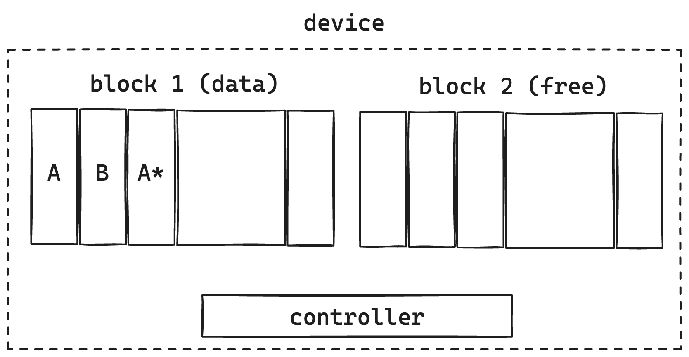
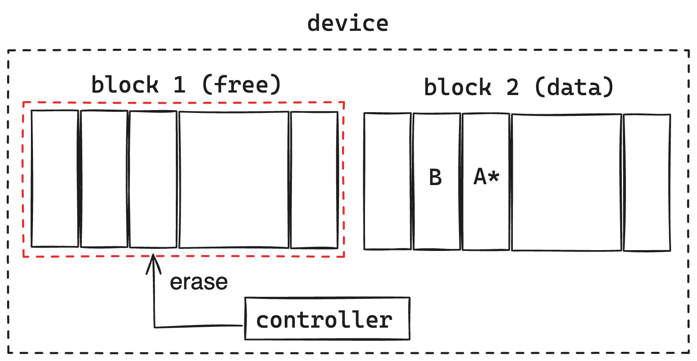

The article present a comprehensive foundational framework to effectively manage
file input / output (further just IO) using Java NIO.

- All example built on Java 1.8 (AdoptOpenJDK 8)
- OS and Kernel acronyms applied to linux only (and tested with Ubuntu)
- All benchmark graphs built with using [jfreechart](https://www.jfree.org/jfreechart/)

Contents:
1. Load type
2. Disk types
3. OS optimizations
4. Java NIO disk API

### Load type
It is important to recognize which load mode is going to be used achieve your goal because
different types of devices know how to serve different queries with different performance.

Random read is when you start anywhere you like in the file and read as much as you like, 
jumping back and forth as you like. Sequential read is when you start at the beginning of the 
file and read as much as you like from there on, but never skip anything or move back.

Using the seek command to move to a different part of the file means that you are using random read. 
If you would use sequential read you would have to read all the data in the file up to the point where the 
relevant data was, which would of course be slow. 
As you can go directly to the right position in the file means that there is not much overhead, and you can expect good 
performance.

Scenarios:
- **Sequential reading**: copy data / backup restoration
- **Append-only write**: replicated log / backup creating
- **Random read**: distribute number of file in to few consumers
- **Random write**: consume few files from few publishers
- **Random read/write**: mixed mode to read/write for one file (database file as example)

Benchmark:

| *Load type (GB per sec)* | 1GB   | 2GB   | 4GB   | 8GB   | 
|--------------------------|-------|-------|-------|-------|
| Sequential reading       | 0.084 | 0.194 | 0.902 | 1.71  |
| Append-only write        | 0.288 | 0.719 | 1.183 | 2.484 |
| Random read              | 0.337 | 0.628 | 0.949 | 2.048 |
| Random write             | 1.342 | 2.538 | 4.955 | 9.819 |

**Plot**:


Note:
Source code to build benchmark table and plot is located in [java_file_io](http://0.0.0.0).
To make it working:
- run unit tests in `./src/test`. tests will build you *Load type (GB per sec)* output files in
`./src/main/resources` such as: `seqReading.txt`, `appendOnlyWrite.txt`, `randomRead.txt`, `randomWrite.txt`.
- run `./src/main/org/example/LoadType.class/main`. That should show you plot based on your data,
generate by (1)

### Disk types

_Legend_:
- &check; means disk effectevly makes these types of IO operations
- &cross; disk also can do that operations but much slower (means order, 10 times and more)
then if you see &check;

| *Load type*        | HDD     | SSD     | SSD NVMe  |
|--------------------|---------|---------|-----------|
| Sequential reading | &check; | &check; | &check;   |
| Append-only write  | &check; | &check; | &check;   |
| Random read        | &cross; | &check; | &check;   |
| Random write       | &cross; | &cross; | &check; * |

All devices in the modern world have block architecture. As outcome of that that means all modern
disk devices operate data by **page** - unit of reading/writing into device (4/8/16 Kb).

As outcome:
- HDD have one mechanical moving part (head) to switch/move between platters what makes random operations 
(seek and read/write after) much slower than sequential operations.
- SSD disks do not have any moving parts by design, as outcome that type of disk have 
internal parallel access to different parts of flash drive memory because of few data buses.
Since they have parallel access, they can serve parallel requests to get data from disk. That makes them
to make random read fast in addition to sequential IO.
- In addition to basic SSD features, NVMe controller caches writes in the onboard NVRAM, 
and flushes it to flash media at opportune times. Write latency is thus the cache access latency typically have microseconds order.
Since typical MVRAM size is about a hundred kilobytes (~144Kb) NVE write for any data which can fit would be very fast.

### NAND flash
Most of modern SSD disks is built by NAND flash design:


Simply that just means:
- disk have minimal unit of data storing - **Page** (4k/8K/16K)
- Number of pages consists **Block** (128/256 pages)

### NAND flash write
Let's consider the typical schema of writing data to SSD by NAND.
For example user makes write of long datatype value with some shift to SSD disk.
When request coming to the disk:
- controller finds for the **page** with that part of file user wants to update
- controller reads data to it's internal buffer 
- rewrites (updates) your long datatype value in the internal buffer
- writes to the **new** page. it does not re-write current page, instead of that
new page is going to be created for your "updated" value inside of **block**


As outcome:
- Write operation will make a new page. It does not matter how many bytes you write -
even change of 1 byte will rewrite page
- **Write amplification** - that is terms which define how many effort we need to write
data. If data less then page size that means data not been written effectively (poor / bad write
amplification).
- Writing is possible only to a **new pages**. That means we need to have any
mechanism to collect garbage from device or memory will exceed pretty soon.

### NAND flash cleanup
NAND by design can operate by blocks only, it does not perform any operations on the page level.
Controller makes constant observation of disk space, and then it identifies by threshold there about
N percents have been used, it starts operation of internal garbage collection.



Using its own internal indexes to identify fresh pages, it takes last snapshot of pages 
over "old" block and copies all pages to available fresh block.


After that controller cleans up whole old block. Whole procedure of moving data and clean up blocks as been
said before called internal GC. Please be aware of during the process of your internal GC, your whole IO latency might 
degrade.



Outcome:
- **Disk operates by pages**. Write data as multiple of page size to have best write amplification and best throughput.
If you have less data than at least one page, buffer data in the RAM till you get size of page (or even better multiple of page size).
- If you write not effectively eg. less than page size, you increase consistent cycle of internal GC and your device
highly likely will have shorter lifetime.

### Kernel - writing and reading
Any JVM based application starts as a process in User Space of operating system. When application have to perform any
IO operation it makes `syscall` what means makes kernel call to make IO operations over device driver which kernel have.


_Note_: JVM JDK (at least in versions 8) does not have any non-blocking call mechanism to perform IO operations because 
UNIX does not support non-blocking I/O for files. As Java should (at least try to) provide the same behaviour on all 
platforms, the `FileChannel` does not implement `SelectableChannel` (https://www.remlab.net/op/nonblock.shtml).
However, Java 7 will include a `AsynchronousFileChannel` class that supports asynchronous 
file I/O, which is a different mechanism to non-blocking I/O.
https://docs.oracle.com/javase/7/docs/api/java/nio/channels/AsynchronousFileChannel.html
```text
An AsynchronousFileChannel is associated with a thread pool to which tasks are submitted to handle I/O events and dispatch 
to completion handlers that consume the results of I/O operations on the channel. 
The completion handler for an I/O operation initiated on a channel is guaranteed to be invoked by one of the threads 
in the thread pool. 
```
In general only sockets and pipes truly support non-blocking I/O via `select()`, `epull()` or `io_ring()` mechanisms.

Outcome:
- Any IO operation is blocking. If you do not want your thread to wait 
- `Syscall` from user space makes context switching what usually takes about 10k clock cycles.
- As result of (1) and (2), if we expect "hot path" during performing IO operations run IO in separate thread
or thread pool (or use `AsynchronousFileChannel` which uses thread pool under the hood).

### Page cache
Disk is extremely slow resource in according to processor cache or even memory.
https://gist.github.com/jboner/2841832

To speed up access to any information on the disk developers made a **cache** in memory. OS also have its own
cache called Page Cache. For that OS allocates specific region operated by **kernel** wherein have to be stored
most frequent data requested from files.
In user perspective he requests some data from disk:
- Application process requests data from disk over kernel `syscall`
- Kernel first checking if that data have been written to page cache first
- If data exist in cache, return that data
- If data do not exist in cache, load that data from device


You have to keep in mind here since kernel completely manages page cache (load / evict page), every
page can be evicted at the discretion of kernel.

### Page Cache load flow

Let's make simple code to read data aligned to page size using `FileChannel`:

```java
ByteBuffer buf = ByteBuffer.allocate(...);
try(FileChannel ch = FileChannel.open(Path.of("YOUR_FILE_PATH"), READ)){
    long size = ch.size;
    long position = 0;
    
    while(position < size){
        int read = ch.read(buf, position);
        if (read <= 0)
            break;
        
        position += buf.position();
        // Add your logic ...
    }
}
```


- start with `ch.read(buf, 0)`
- Page Cache -> Get Page
- if found in page cache then fill buffer in virtual memory of process (no disk IO)
- if not found: read page from disk to page cache -> load page from page cache and fill buffer in virtual memory of process.
Disk IO equals 1 page plus CPU for page cache load/evict LRU page

Now let's make not aligned reading. That might look like:
```java
ByteBuffer buf = ByteBuffer.allocate(...);
try(FileChannel ch = FileChannel.open(Path.of("YOUR_FILE_PATH"), READ)){
    long size = ch.size;
    long position = 2048;
    
    while(position < size){
        int read = ch.read(buf, position);
        if (read <= 0)
            break;
        
        position += buf.position();
        // Add your logic ...
    }
}
```


- start with `ch.read(buf, 6144)`
- Page Cache gets 2 pages
- if found in page cache then fill buffer in virtual memory of process (no disk IO)
- if not found: read 2 pages from disk to page cache -> load page from page cache and fill buffer in virtual memory of process.
  Disk IO equals 2 pages plus CPU for page cache load/evict LRU page

As you may see we spend more resources to read same data volume if we do not align read/write with page size.
Just notice, that only have been achieved by changing buffer shift (not buffer size itself).

Now let's see by benchmark how aligned / not-aligned reading impact latency by percentiles:

Benchmark:

| *p*         | 0      | 0.5  | 0.9    | 0.95 | 0.99 | 0.999 | 0.9999  | 
|-------------|--------|------|--------|------|------|-------|---------|
| Aligned     | 2708   | 3000 | 3125   | 3125 | 3125 | 4042  | 502413  |
| Not-aligned | 3125   | 3417 | 3541   | 3542 | 3542 | 4250  | 1889361 |
| %           | 14.36% | 9.5% | 11.75% | 12%  | 12%  | 5%    | 126%    |

**Plots** (logarithmic view):


Note:
Source code to build benchmark table and plot is located in [java_file_io](http://0.0.0.0).
To make it working:
- run unit tests in `./src/test/pagecache`. tests will build you *percentile* output files in
  `./src/main/resources` such as: `alignedLatencyPercentile.txt`, `notAlignedLatencyPercentile.txt`.
- run `./src/main/org/example/PageClass.class/main`. That should show you plot based on your data,
  generate by (1)

*** Page Cache read ahead
Sequential reading is very common pattern in many application workflows. So any modern OS
(linux in particular) have read-ahead mechanism to improve latency accordingly in this case.
Kernel can identify if user reads data sequentially and pull part of data to page cache in ahead to 
prevent expensive loading from disk. This incredible feature can significantly improve sequential reading except
the case it is not all time expected behavior (in context of other load types).
To manage that behavior of kernel, there is `syscall` - `fadvice` ([fadvice docs](https://pubs.opengroup.org/onlinepubs/9699919799/functions/posix_fadvise.html#:~:text=The%20posix_fadvise()%20function%20shall,currently%20exist%20in%20the%20file)).

```text
FADV_NORMAL
    No special treatment.
FADV_RANDOM
    Expect page references in random order.
FADV_SEQUENTIAL
    Expect page references in sequential order.
FADV_WILLNEED
    Expect access in the near future.
FADV_DONTNEED
    Do not expect access in the near future. Subsequent access of pages in this range will succeed, but will result either in reloading of the memory contents from the underlying mapped file or zero-fill-in-demand pages for mappings without an underlying file.
FADV_NOREUSE
    Access data only once.
```

JVM example with [nio-one](https://github.com/odnoklassniki/one-nio):
```java
try(FileChannel ch = FileChannel.open(Paths.get(baseTestPath + fileName), READ)){
    // file channel
    Field fdChannel = JavaInternals.getField(FileChannelImpl.class, "fd");
    Object fdDescriptor = fdChannel.get(ch);
    // file descriptor value
    Field fdField = JavaInternals.getField(FileDescriptor.class, "fd");
    int fd = fdField.getInt(fdDescriptor);

    int fAdviceFlag = Mem.POSIX_FADV_RANDOM;
    Mem.posix_fadvise(fd, 0, ch.size(), fAdviceFlag);
    while(buf.hasRemaining()){
        int bytes = ch.read(buf);
        if (bytes <= 0){
            break;
        }
    }
} catch (IOException | IllegalAccessException e) {
    throw new RuntimeException(e);
}
```
Full example in `java_file_io/src/test/java/pagecache/PageCacheReadAheadTest`


Applying page cache read ahead directives best on your load type pattern can significantly improve your latency.

<!--
Benchmark:

In progress...
-->

### Outcome of page cache

- Read/write with chunks aligned by page size
- Write chunks by page size
- Page cache is memory region managed by Kernel which caching data from disk for faster reading and buffering data for 
more effective writing
- Read ahead - page cache strategy to make decision and read data ahead of requested data. Highly effective for sequential
reading such as read data from file on start or media file. If you need random access instead use `fadvice` syscall to improve
your latency.

### Reading redundancy

Lets imaging case when one have to be available for a few different application processes.
When we read that file, we copy data from page cache to virtual memory of reading process. If few applications perform
reading operation, each of them accordingly have its own copy of data in its own virtual memory. That introduces question - 
if there is opportunity read data not copying them to virtual memory of process? 


