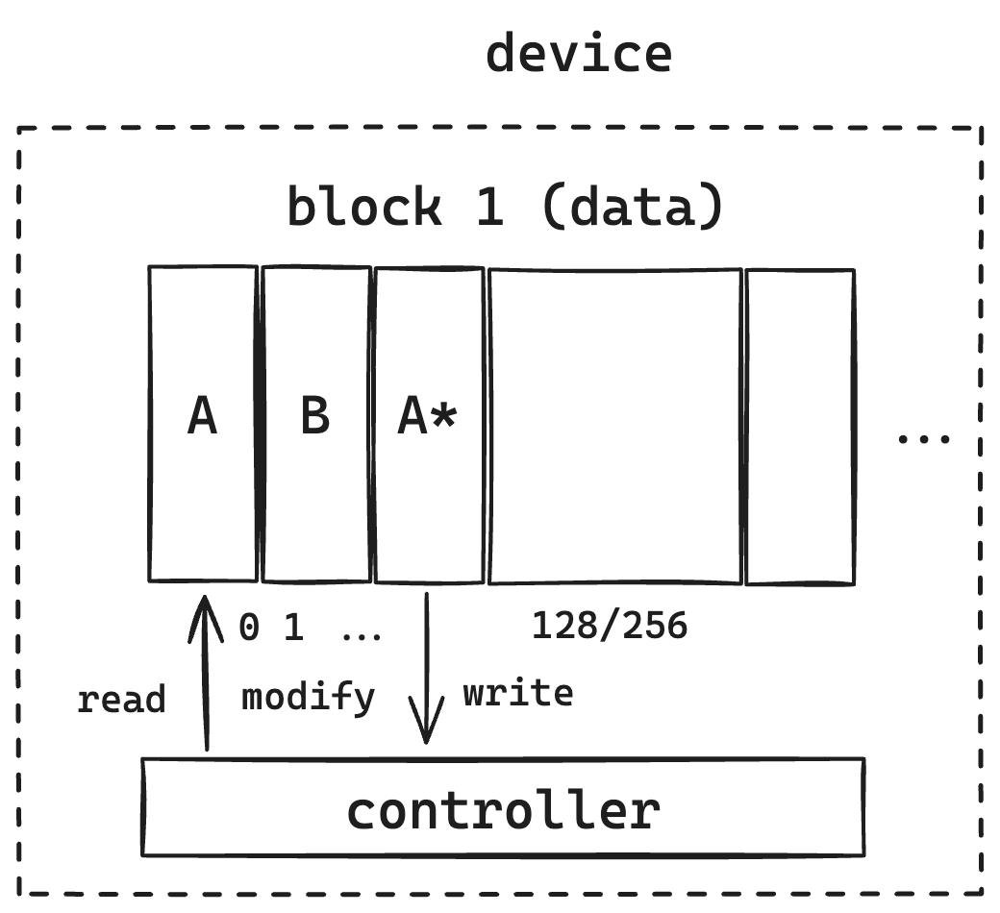
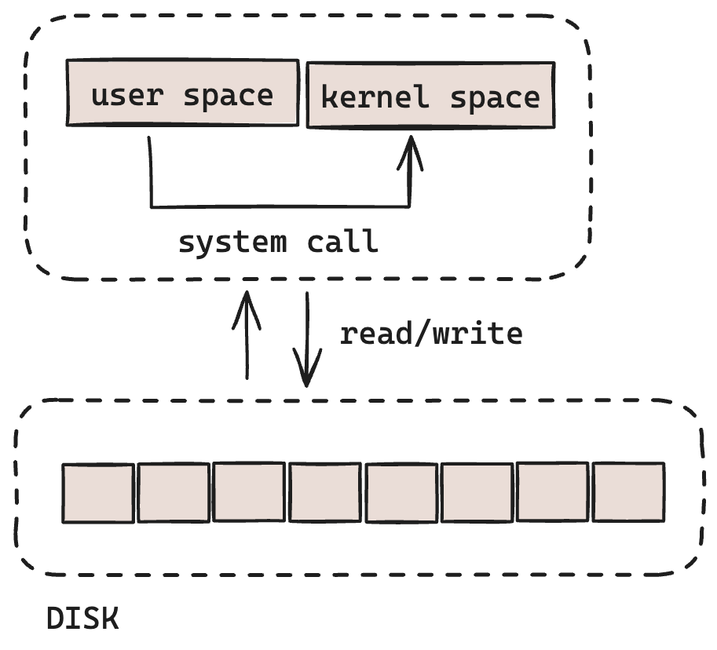
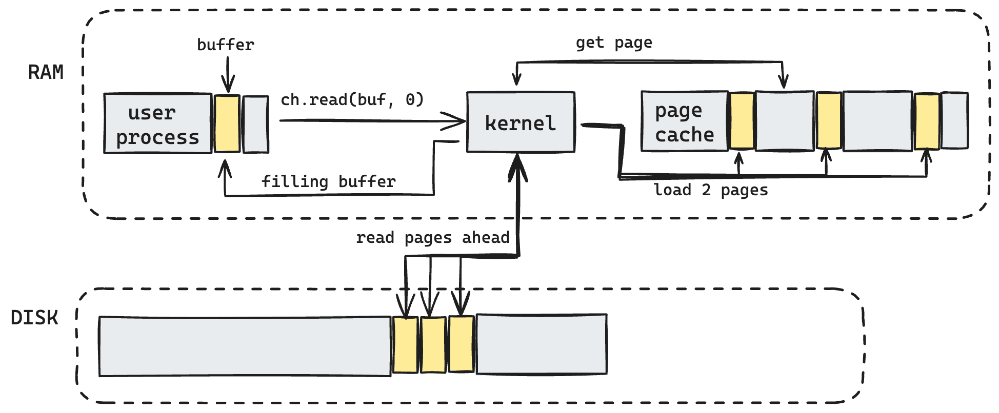
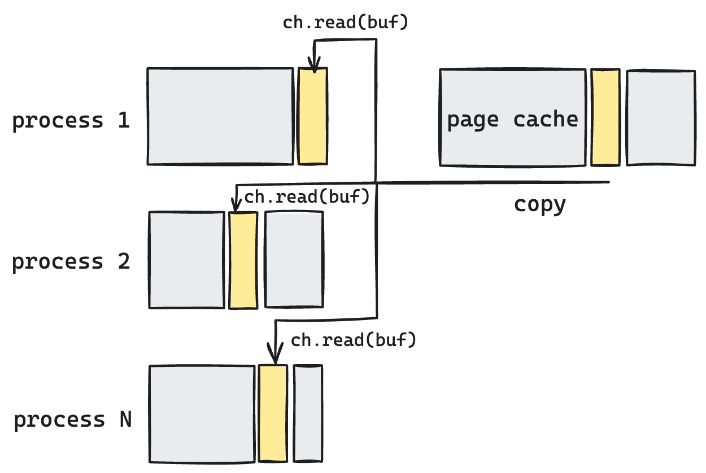
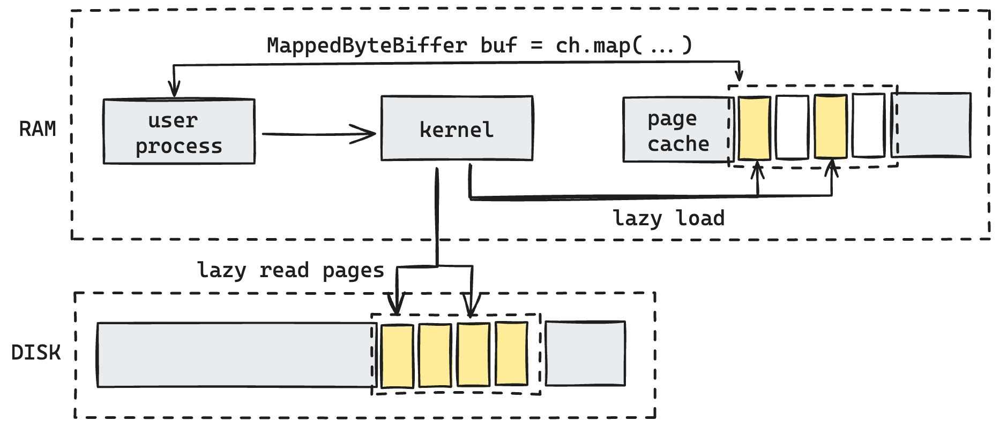
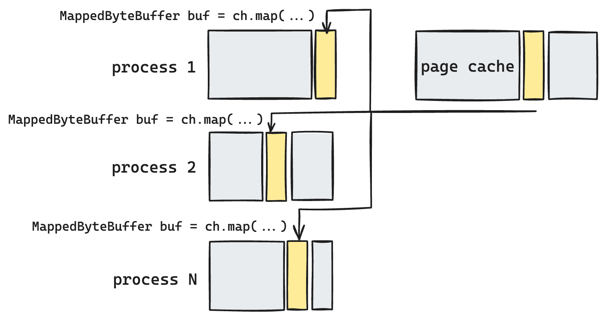
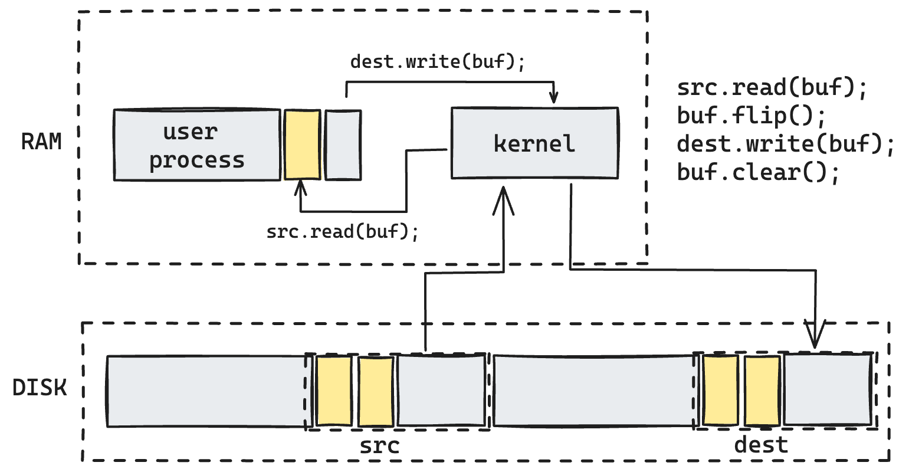
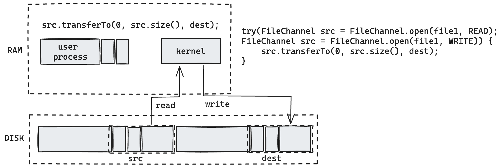

The article presents a comprehensive foundational framework for effectively managing file input/output 
(referred to as IO hereafter) utilizing Java NIO (New Input/Output).

Preliminary Notes:

- All examples are built using Java 1.8 (AdoptOpenJDK 8).
- Acronyms for operating system (OS) and kernel references are specific to Linux and have been tested on Ubuntu.
- All benchmark graphs have been generated using [JFreeChart](https://www.jfree.org/jfreechart/).

Contents:
1. [Hardware](#Hardware)
   1. [Load types](#load-types)
   2. [Disk types](#disk-types)
   3. [Outcomes](#)
2. [Kernel optimizations](#page-cache)
   1. [Page cache](#page-cache)
   2. [Read ahead pages](#page-cache-read-ahead)
   3. [Reading redundancy and mmap](#reading-redundancy)
   4. [Disable cache with O_DIRECT](#)
   5. [Outcomes](#)
3. [Java NIO disk API internals](#)
   1. [Direct buffers](#)
   2. [Zero-copy file transfer](#)
   3. [Outcomes](#)
4. [Summary](#)

## Hardware
Hardware stands as the cornerstone in constructing robust, scalable, and high-throughput systems. 
Understanding your hardware's features empowers you to develop the most effective software tailored to your objectives. 
In the following sections, I will define some hardware aspects which impact disk IO performance.

### Load types
It's crucial to identify the intended load mode to achieve your goals, as various types of 
devices excel at serving different queries with distinct performance characteristics.

Random read entails starting at any point within the file and reading any desired amount of data, 
allowing for jumping back and forth within the file as needed. 
Sequential read, on the other hand, involves starting from the beginning of the file and reading 
continuously from that point onward, without skipping any data or moving backward.
Utilizing the seek command to navigate to a different section of the file implies employing random read functionality.
If sequential read were employed, it would necessitate reading all the data in the file up to the point where the 
relevant data is located. This approach would inherently be slower due to the need to process unnecessary data.
The ability to directly access the desired position in the file minimizes overhead, resulting in an expectation 
of good performance.

Scenarios:
- **Sequential reading**: copy data / backup restoration
- **Append-only write**: replicated log / backup creating
- **Random read**: distribute number of file in to few consumers
- **Random write**: consume few files from few publishers
- **Random read/write**: mixed mode to read/write for one file (database file as example)

Benchmark:

| *Load type (GB per sec)* | 1GB   | 2GB   | 4GB   | 8GB   | 
|--------------------------|-------|-------|-------|-------|
| Sequential reading       | 0.084 | 0.194 | 0.902 | 1.71  |
| Append-only write        | 0.288 | 0.719 | 1.183 | 2.484 |
| Random read              | 0.337 | 0.628 | 0.949 | 2.048 |
| Random write             | 1.342 | 2.538 | 4.955 | 9.819 |

**Plot**:


_Note_:
If you would like to repeat results on your machine (benchmark / plot):
- run unit tests in `./src/test`. tests will build you *Load type (GB per sec)* output files in
`./src/main/resources` such as: `seqReading.txt`, `appendOnlyWrite.txt`, `randomRead.txt`, `randomWrite.txt`.
- run `./src/main/org/example/LoadType.class/main`. That should show you plot based on your data,
generate by (1)

### Disk types

_Legend_:
- &check; means disk effectevly makes these types of IO operations
- &cross; disk also can do that operations but much slower (means order, 10 times and more)
then if you see &check;

| *Load type*        | HDD     | SSD     | SSD NVMe  |
|--------------------|---------|---------|-----------|
| Sequential reading | &check; | &check; | &check;   |
| Append-only write  | &check; | &check; | &check;   |
| Random read        | &cross; | &check; | &check;   |
| Random write       | &cross; | &cross; | &check; * |

All disk devices operate on a block architecture, which means that modern disk devices 
handle data in units known as pages. These pages represent the fundamental units for 
reading and writing data into the device, typically ranging in size from 4 to 16 kilobytes.

Brief summary on disk types:
- HDD have one mechanical moving part (head) to switch/move between platters what makes random operations 
(seek and read/write after) much slower than sequential operations.
- SSD disks do not have any moving parts by design, as outcome that type of disk have 
internal parallel access to different parts of flash drive memory because of few data buses.
Since they have parallel access, they can serve parallel requests to get data from disk. That makes them
to make random read fast in addition to sequential IO.
- In addition to basic SSD features, NVMe controller caches writes in the onboard NVRAM, 
and flushes it to flash media at opportune times. Write latency is thus the cache access latency typically have microseconds order.
Since typical MVRAM size is about a hundred kilobytes (~144Kb) NVE write for any data which can fit would be very fast.

Here's a brief summary of disk types:

- **HDD** (Hard Disk Drive): HDDs contain a single mechanical moving part, the head, 
which is responsible for switching/moving between platters. This mechanical operation 
makes random operations (such as seeking and read/write) considerably slower compared 
to sequential operations.
- **SSD** (Solid State Drive): SSDs are designed without any moving parts. They feature 
internal parallel access to different parts of the flash drive memory due to multiple data buses. 
This parallel access enables SSDs to serve parallel requests for data retrieval, 
making both random reads and sequential IO operations fast.
- **NVMe** (Non-Volatile Memory Express) SSD: NVMe SSDs, in addition to the basic features of SSDs, 
incorporate a controller that caches writes in onboard NVRAM (Non-Volatile Random Access Memory). 
These writes are then flushed to the flash media at opportune times. 
The latency for write operations is typically on the order of microseconds, 
as access to the cache is swift. Given that the typical size of NVRAM is around a 
hundred kilobytes (~144KB), NVMe writes for data that can fit within this cache size 
are exceptionally fast.

The majority of modern SSD disks are constructed using **NAND** flash memory technology:

----


Simply put, this means that a disk has a minimal unit of data storage known as a page 
(typically 4KB, 8KB, or 16KB in size), and a certain number of these pages form a block 
(usually comprising 128 or 256 pages).

### NAND flash write
Let's consider the typical schema of writing data to SSD by NAND.
For example user makes write of long datatype value with some shift to SSD disk.
When request coming to the disk:
- controller finds for the **page** with that part of file user wants to update
- controller reads data to it's internal buffer 
- rewrites (updates) your long datatype value in the internal buffer
- writes to the **new** page. it does not re-write current page, instead of that
new page is going to be created for your "updated" value inside of **block**



As outcome:
- Write operation will make a new page. It does not matter how many bytes you write -
even change of 1 byte will rewrite page
- **Write amplification** - that is terms which define how many effort we need to write
data. If data less then page size that means data not been written effectively (poor / bad write
amplification).
- Writing is possible only to a **new pages**. That means we need to have any
mechanism to collect garbage from device or memory will exceed pretty soon.

#### NAND flash cleanup
NAND by design can operate by blocks only, it does not perform any operations on the page level.
Controller makes constant observation of disk space, and then it identifies by threshold there about
N percents have been used, it starts operation of internal garbage collection.


Using its own internal indexes to identify fresh pages, it takes last snapshot of pages 
over "old" block and copies all pages to available fresh block.


After that controller cleans up whole old block. Whole procedure of moving data and clean up blocks as been
said before called internal GC. Please be aware of during the process of your internal GC, your whole IO latency might 
degrade.


Outcome:
- **Disk operates by pages**. Write data as multiple of page size to have best write amplification and best throughput.
If you have less data than at least one page, buffer data in the RAM till you get size of page (or even better multiple of page size).
- If you write not effectively eg. less than page size, you increase consistent cycle of internal GC and your device
highly likely will have shorter lifetime.

### Kernel - writing and reading
Any JVM based application starts as a process in User Space of operating system. When application have to perform any
IO operation it makes `syscall` what means makes kernel call to make IO operations over device driver which kernel have.



_Note_: JVM JDK (at least in versions 8) does not have any non-blocking call mechanism to perform IO operations because 
UNIX does not support non-blocking I/O for files. As Java should (at least try to) provide the same behaviour on all 
platforms, the `FileChannel` does not implement `SelectableChannel` (https://www.remlab.net/op/nonblock.shtml).
However, Java 7 will include a `AsynchronousFileChannel` class that supports asynchronous 
file I/O, which is a different mechanism to non-blocking I/O.
https://docs.oracle.com/javase/7/docs/api/java/nio/channels/AsynchronousFileChannel.html
```text
An AsynchronousFileChannel is associated with a thread pool to which tasks are submitted to handle I/O events and dispatch 
to completion handlers that consume the results of I/O operations on the channel. 
The completion handler for an I/O operation initiated on a channel is guaranteed to be invoked by one of the threads 
in the thread pool. 
```
In general only sockets and pipes truly support non-blocking I/O via `select()`, `epull()` or `io_ring()` mechanisms.

Outcome:
- Any IO operation is blocking. If you do not want your thread to wait 
- `Syscall` from user space makes context switching what usually takes about 10k clock cycles.
- As result of (1) and (2), if we expect "hot path" during performing IO operations run IO in separate thread
or thread pool (or use `AsynchronousFileChannel` which uses thread pool under the hood).

### Page cache
Disk is extremely slow resource in according to processor cache or even memory.
https://gist.github.com/jboner/2841832

To speed up access to any information on the disk developers made a **cache** in memory. OS also have its own
cache called Page Cache. For that OS allocates specific region operated by **kernel** wherein have to be stored
most frequent data requested from files.
In user perspective he requests some data from disk:
- Application process requests data from disk over kernel `syscall`
- Kernel first checking if that data have been written to page cache first
- If data exist in cache, return that data
- If data do not exist in cache, load that data from device


You have to keep in mind here since kernel completely manages page cache (load / evict page), every
page can be evicted at the discretion of kernel.

### Page Cache load flow

Let's make simple code to read data aligned to page size using `FileChannel`:

```java
ByteBuffer buf = ByteBuffer.allocate(...);
try(FileChannel ch = FileChannel.open(Path.of("YOUR_FILE_PATH"), READ)){
    long size = ch.size;
    long position = 0;
    
    while(position < size){
        int read = ch.read(buf, position);
        if (read <= 0)
            break;
        
        position += buf.position();
        // Add your logic ...
    }
}
```


- start with `ch.read(buf, 0)`
- Page Cache -> Get Page
- if found in page cache then fill buffer in virtual memory of process (no disk IO)
- if not found: read page from disk to page cache -> load page from page cache and fill buffer in virtual memory of process.
Disk IO equals 1 page plus CPU for page cache load/evict LRU page

Now let's make not aligned reading. That might look like:
```java
ByteBuffer buf = ByteBuffer.allocate(...);
try(FileChannel ch = FileChannel.open(Path.of("YOUR_FILE_PATH"), READ)){
    long size = ch.size;
    long position = 2048;
    
    while(position < size){
        int read = ch.read(buf, position);
        if (read <= 0)
            break;
        
        position += buf.position();
        // Add your logic ...
    }
}
```


- start with `ch.read(buf, 6144)`
- Page Cache gets 2 pages
- if found in page cache then fill buffer in virtual memory of process (no disk IO)
- if not found: read 2 pages from disk to page cache -> load page from page cache and fill buffer in virtual memory of process.
  Disk IO equals 2 pages plus CPU for page cache load/evict LRU page

As you may see we spend more resources to read same data volume if we do not align read/write with page size.
Just notice, that only have been achieved by changing buffer shift (not buffer size itself).

Now let's see by benchmark how aligned / not-aligned reading impact latency by percentiles:

Benchmark:

| *p*         | 0      | 0.5  | 0.9    | 0.95 | 0.99 | 0.999 | 0.9999  | 
|-------------|--------|------|--------|------|------|-------|---------|
| Aligned     | 2708   | 3000 | 3125   | 3125 | 3125 | 4042  | 502413  |
| Not-aligned | 3125   | 3417 | 3541   | 3542 | 3542 | 4250  | 1889361 |
| %           | 14.36% | 9.5% | 11.75% | 12%  | 12%  | 5%    | 126%    |

**Plots** (logarithmic view):


Note:
Source code to build benchmark table and plot is located in [java_file_io](http://0.0.0.0).
To make it working:
- run unit tests in `./src/test/pagecache`. tests will build you *percentile* output files in
  `./src/main/resources` such as: `alignedLatencyPercentile.txt`, `notAlignedLatencyPercentile.txt`.
- run `./src/main/org/example/PageClass.class/main`. That should show you plot based on your data,
  generate by (1)

### Page Cache read ahead
Sequential reading is very common pattern in many application workflows. So any modern OS
(linux in particular) have read-ahead mechanism to improve latency accordingly in this case.
Kernel can identify if user reads data sequentially and pull part of data to page cache in ahead to 
prevent expensive loading from disk. This incredible feature can significantly improve sequential reading except
the case it is not all time expected behavior (in context of other load types).
To manage that behavior of kernel, there is `syscall` - `fadvice` ([fadvice docs](https://pubs.opengroup.org/onlinepubs/9699919799/functions/posix_fadvise.html#:~:text=The%20posix_fadvise()%20function%20shall,currently%20exist%20in%20the%20file)).

```text
FADV_NORMAL
    No special treatment.
FADV_RANDOM
    Expect page references in random order.
FADV_SEQUENTIAL
    Expect page references in sequential order.
FADV_WILLNEED
    Expect access in the near future.
FADV_DONTNEED
    Do not expect access in the near future. Subsequent access of pages in this range will succeed, but will result either in reloading of the memory contents from the underlying mapped file or zero-fill-in-demand pages for mappings without an underlying file.
FADV_NOREUSE
    Access data only once.
```

JVM example with [nio-one](https://github.com/odnoklassniki/one-nio):
```java
try(FileChannel ch = FileChannel.open(Paths.get(baseTestPath + fileName), READ)){
    // file channel
    Field fdChannel = JavaInternals.getField(FileChannelImpl.class, "fd");
    Object fdDescriptor = fdChannel.get(ch);
    // file descriptor value
    Field fdField = JavaInternals.getField(FileDescriptor.class, "fd");
    int fd = fdField.getInt(fdDescriptor);

    int fAdviceFlag = Mem.POSIX_FADV_RANDOM;
    Mem.posix_fadvise(fd, 0, ch.size(), fAdviceFlag);
    while(buf.hasRemaining()){
        int bytes = ch.read(buf);
        if (bytes <= 0){
            break;
        }
    }
} catch (IOException | IllegalAccessException e) {
    throw new RuntimeException(e);
}
```
Full example in `java_file_io/src/test/java/pagecache/PageCacheReadAheadTest`



Applying page cache read ahead directives best on your load type pattern can significantly improve your latency.

<!--
Benchmark:

In progress...
-->

### Outcome of page cache

- Read/write with chunks aligned by page size
- Write chunks by page size
- Page cache is memory region managed by Kernel which caching data from disk for faster reading and buffering data for 
more effective writing
- Read ahead - page cache strategy to make decision and read data ahead of requested data. Highly effective for sequential
reading such as read data from file on start or media file. If you need random access instead use `fadvice` syscall to improve
your latency.

### Reading redundancy

Lets imaging case when one have to be available for a few different application processes.
When we read that file, we copy data from page cache to virtual memory of reading process. If few applications perform
reading operation, each of them accordingly have its own copy of data in its own virtual memory. That introduces question - 
if there is opportunity read data not copying them to virtual memory of process? 



Yes, that is **memory mapped file** implemented over _syscall_ `mmap`. 
`mmap` can to tie up region in memory with file and work with that region using `ByteBuffer` without copying
data to virtual memory of process.



`mmap` might be extremely powerful tool in perspective of to work with memory region directly over byte buffer, but also
have some cons you have to know about:
- no IO exception - it is hard to track down file have been deleted since you work with memory region at this moment
- `mmap` have limits - you can't map more than 2GB file
- there is limit either to have number of mapped files per process. It is configured as `max_map_count` in
`etc/sysctl.conf`

Let's look on `mmap` basic example:
```java
try(FileChannel ch = FileChannel.open(Paths.get(baseTestPath + fileName), READ, WRITE)){
    MappedByteBuffer mmap = ch.map(FileChannel.MapMode.READ_WRITE, 0, ch.size());
    // load data in memory
    mmap.load();
    // make some operations with memory using buffer same way as we do with file

    // flash data to file back
    mmap.force();
}
```

there is how `mmap` going to work over multiple processes:



`mmap` syscall have different work modes (they called flag arguments):
https://man7.org/linux/man-pages/man2/mmap.2.html

```text
MAP_SHARED
        Share this mapping.  Updates to the mapping are visible to
        other processes mapping the same region, and (in the case
        of file-backed mappings) are carried through to the
        underlying file.  (To precisely control when updates are
        carried through to the underlying file requires the use of
        msync(2).)

 MAP_SHARED_VALIDATE (since Linux 4.15)
        This flag provides the same behavior as MAP_SHARED except
        that MAP_SHARED mappings ignore unknown flags in flags.
        By contrast, when creating a mapping using
        MAP_SHARED_VALIDATE, the kernel verifies all passed flags
        are known and fails the mapping with the error EOPNOTSUPP
        for unknown flags.  This mapping type is also required to
        be able to use some mapping flags (e.g., MAP_SYNC).

 MAP_PRIVATE
        Create a private copy-on-write mapping.  Updates to the
        mapping are not visible to other processes mapping the
        same file, and are not carried through to the underlying
        file.  It is unspecified whether changes made to the file
        after the mmap() call are visible in the mapped region.
```

For example `MAP_SHARED` allows to see all modifications of one process to all others and as outcome
we can build outer-process communication using that feature.

### O_DIRECT

In some use cases we do not need to have page cache at all. We want to have full control of data which we read or write.
The directive `O_DIRECT` applied to `syscall` `open`.


Why would we use that directive at all assuming page cache is great tool to improve latency of yours file IO calls?
If you are using your own page cache model (by example for database) you do not need to either have one more default from linux.

O_DIRECT having the following limits:
- You are able to read/write only by aligned blocks (not shifting)
- Since page cache is disabled, read ahead option won't work either

If you're using JDK 17, that feature have been implemented there - 
https://github.com/openjdk/jdk/commit/ec1c3bce45261576d64685a9f9f8eff163ea9452

```java
import com.sun.nio.file.ExtendedOpenOption;

import java.nio.channels.FileChannel;
import java.nio.file.StandardOpenOption;

FileChannel fc = FileChannel.open(f.toPath(), StandardOpenOption.WRITE, ExtendedOpenOption.DIRECT);
```

For JDK less than 17 there is library https://github.com/smacke/jaydio/tree/master. For JDK 8 and 11, 
there is old but good library built by Stephen Macke - https://github.com/smacke/jaydio.
Basic example how to use `jaydio` can be found in `src/test/odirect` folder.

Outcome:
- beneficial use `mmap` to avoid copying data into virtual memory
- `mmap` have limits you have to keep in mind - lazy loading to page cache, limit of files per process, no IOException
- `O_DIRECT` can disable page cache for your file.
- `O_DIRECT` either have limits - you can read/write only aligned blocks, `readahead` won't work

### Direct buffers
As been said before, when `FileChannel` reads or writes files, it uses `syscalls`.
When file channel reads data it calls native call, which reads data by **some address** to virtual memory of our process.

Source code of JDK with details:
https://github.com/frohoff/jdk8u-jdk/blob/master/src/share/classes/sun/nio/ch/IOUtil.java#L37

Since JVM is working with head buffer, how could it get that address?


Obvious solution JDK developers is to create direct buffer, which allocated out of heap. 
Since you create direct buffer with reference on it, you can read data into it and then copy
that data from direct buffer into heap buffer.
Looks like good solution, but as you may notice, we got additional copying of data as outcome of that operation.

_Note_: since to allocate / deallocate direct buffer(s) is expensive operation, file channel implementation have
special buffer cache to re-use already allocated direct buffers.

Let's look on the internal implementation of read from file channel:
```java
static int read(FileDescriptor fd, ByteBuffer dst, long position,
                    NativeDispatcher nd)
        throws IOException
{
    if (dst.isReadOnly())
        throw new IllegalArgumentException("Read-only buffer");
    if (dst instanceof DirectBuffer)
        return readIntoNativeBuffer(fd, dst, position, nd);

    // Substitute a native buffer
    ByteBuffer bb = Util.getTemporaryDirectBuffer(dst.remaining());
    try {
        int n = readIntoNativeBuffer(fd, bb, position, nd);
        bb.flip();
        if (n > 0)
            dst.put(bb);
        return n;
    } finally {
        Util.offerFirstTemporaryDirectBuffer(bb);
    }
}
```
As you may see method tries to identify if destination buffer is already direct buffer and if so
it does not create and temporary buffer and not copying over data to heap buffer before to return it.

How that additional copying may impact your throughput:

Benchmark:

|        | 1MB    | 8Mb  | 16MB   | 64MB | 512MB | 1GB  |
|--------|--------|------|--------|------|-------|------|
| heap   | 2708   | 3000 | 3125   | 3125 | 3125  | 4042 |
| direct | 3125   | 3417 | 3541   | 3542 | 3542  | 4250 |
| %      | 14.36% | 9.5% | 11.75% | 12%  | 12%   | 5%   |

**Plot**:

Ok we got direct buffer can provide us much better throughput because it avoids additional copying during IO operations:

```java
import java.nio.ByteBuffer;

ByteBuffer buf = ByteBuffer.allocateDirect(...);
```

But obviously there is price we have to pay for it:

- Since direct buffer is off-heap buffer, you can't release buffer memory by `buf.clear()`
- Memory will be release only after GC iteration, as soon as GC will remove `buf` object from generation

**BufferCache**
Keep in mind `BufferCache` is **thread-local** object
```java
// Per-thread cache of temporary direct buffers
private static ThreadLocal<BufferCache> bufferCache =
    new ThreadLocal<BufferCache>()
{
    @Override
    protected BufferCache initialValue() {
        return new BufferCache();
    }
};
```
what means if you operate buffers in separate threads, cache is going have high memory consumption!

Buffer cache have limited pool size:
```java
// The number of temp buffers in our pool
    private static final int TEMP_BUF_POOL_SIZE = IOUtil.IOV_MAX;
```
(defined by `jdk.nio.maxCachedBufferSize`, you can change that value - by default it 1024 for JDK 8).

Keep in mind every buffer with bigger size will be allocated in this pool!

### Effective data copy (`transferTo`)

What if we need to copy one file (or part of file) to another file?

We can just use naive copy approach:



To reduce numbers of copying data we can use `syscall` again (it called `sendfile`)
to directly copy data from one place by another by Kernel.
This method have been implemented in NIO and called `transferTo`

