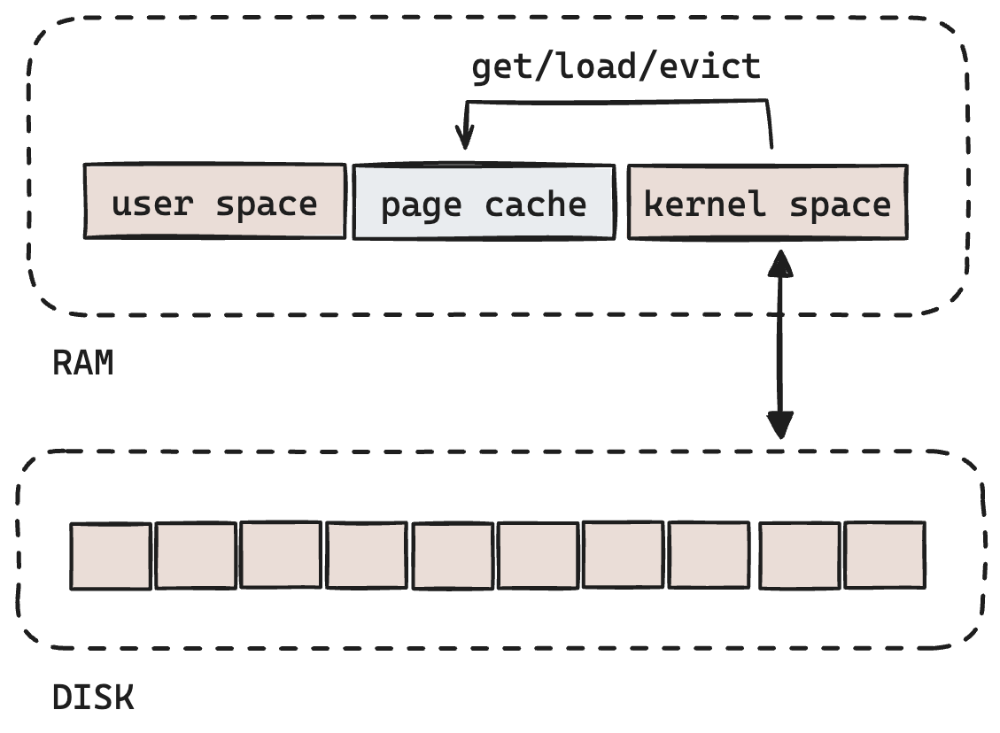
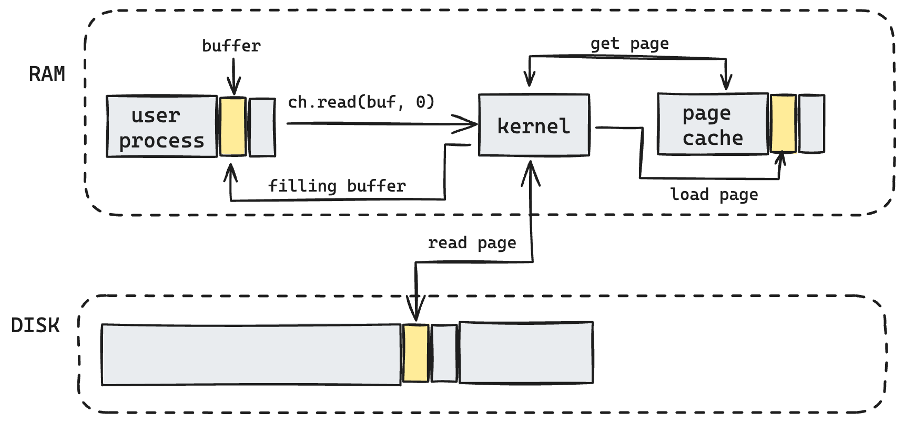
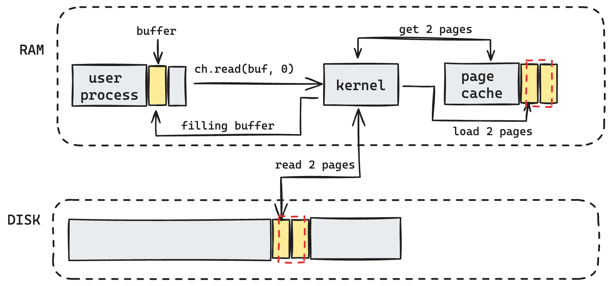
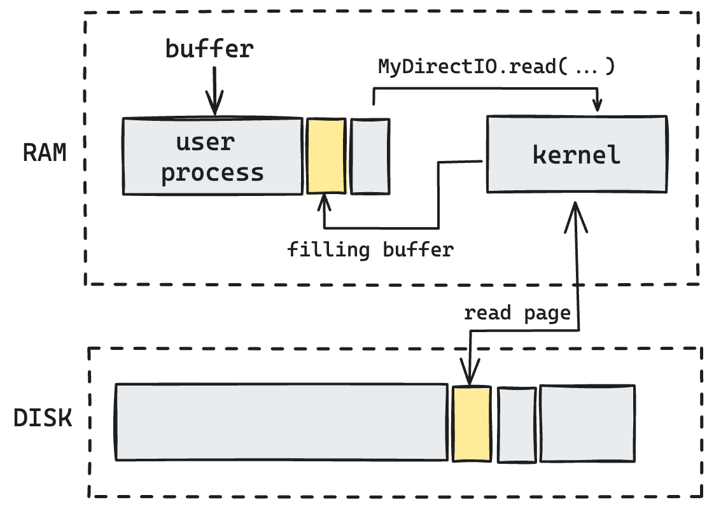

The article presents a comprehensive foundational framework for effectively managing file input/output 
(referred to as IO hereafter) utilizing Java NIO (New Input/Output).

Preliminary Notes:

- All examples are built using Java 1.8 (AdoptOpenJDK 8).
- Acronyms for operating system (OS) and kernel references are specific to Linux and have been tested on Ubuntu.
- All benchmark graphs have been generated using [JFreeChart](https://www.jfree.org/jfreechart/).

Contents:
1. [Hardware](#Hardware)
   1. [Load types](#load-types)
   2. [Disk types](#disk-types)
   3. [Outcomes](#)
2. [Kernel optimizations](#page-cache)
   1. [Page cache](#page-cache)
   2. [Read ahead pages](#page-cache-read-ahead)
   3. [Reading redundancy and mmap](#reading-redundancy)
   4. [Disable cache with O_DIRECT](#)
   5. [Outcomes](#)
3. [Java NIO disk API internals](#)
   1. [Direct buffers](#)
   2. [Zero-copy file transfer](#)
   3. [Outcomes](#)
4. [Summary](#Summary)

## Hardware
Hardware stands as the cornerstone in constructing robust, scalable, and high-throughput systems. 
Understanding your hardware's features empowers you to develop the most effective software tailored to your objectives. 
In the following sections, I will define some hardware aspects which impact disk IO performance.

### Load types
It's crucial to identify the intended load mode to achieve your goals, as various types of 
devices excel at serving different queries with distinct performance characteristics.

Random read entails starting at any point within the file and reading any desired amount of data, 
allowing for jumping back and forth within the file as needed. 
Sequential read, on the other hand, involves starting from the beginning of the file and reading 
continuously from that point onward, without skipping any data or moving backward.
Utilizing the seek command to navigate to a different section of the file implies employing random read functionality.
If sequential read were employed, it would necessitate reading all the data in the file up to the point where the 
relevant data is located. This approach would inherently be slower due to the need to process unnecessary data.
The ability to directly access the desired position in the file minimizes overhead, resulting in an expectation 
of good performance.

Scenarios:
- **Sequential reading**: copy data / backup restoration
- **Append-only write**: replicated log / backup creating
- **Random read**: distribute number of file in to few consumers
- **Random write**: consume few files from few publishers
- **Random read/write**: mixed mode to read/write for one file (database file as example)

Benchmark:

| *Load type (GB per sec)* | 1GB   | 2GB   | 4GB   | 8GB   | 
|--------------------------|-------|-------|-------|-------|
| Sequential reading       | 0.084 | 0.194 | 0.902 | 1.71  |
| Append-only write        | 0.288 | 0.719 | 1.183 | 2.484 |
| Random read              | 0.337 | 0.628 | 0.949 | 2.048 |
| Random write             | 1.342 | 2.538 | 4.955 | 9.819 |

**Plot**:


_Note_:
If you would like to repeat results on your machine (benchmark / plot):
- run unit tests in `./src/test/loadtype`. tests will build you *Load type (GB per sec)* output files in
`./src/main/resources` such as: `seqReading.txt`, `appendOnlyWrite.txt`, `randomRead.txt`, `randomWrite.txt`.
- run `./src/main/org/example/LoadType.class/main`. That should show you plot based on your data,
generate by (1)

### Disk types

_Legend_:
- &check; means disk effectevly makes these types of IO operations
- &cross; disk also can do that operations but much slower (means order, 10 times and more)
then if you see &check;

| *Load type*        | HDD     | SSD     | SSD NVMe  |
|--------------------|---------|---------|-----------|
| Sequential reading | &check; | &check; | &check;   |
| Append-only write  | &check; | &check; | &check;   |
| Random read        | &cross; | &check; | &check;   |
| Random write       | &cross; | &cross; | &check; * |

All disk devices operate on a block architecture, which means that modern disk devices 
handle data in units known as pages. These pages represent the fundamental units for 
reading and writing data into the device, typically ranging in size from 4 to 16 kilobytes.

Brief summary on disk types:
- HDD have one mechanical moving part (head) to switch/move between platters what makes random operations 
(seek and read/write after) much slower than sequential operations.
- SSD disks do not have any moving parts by design, as outcome that type of disk have 
internal parallel access to different parts of flash drive memory because of few data buses.
Since they have parallel access, they can serve parallel requests to get data from disk. That makes them
to make random read fast in addition to sequential IO.
- In addition to basic SSD features, NVMe controller caches writes in the onboard NVRAM, 
and flushes it to flash media at opportune times. Write latency is thus the cache access latency typically have microseconds order.
Since typical MVRAM size is about a hundred kilobytes (~144Kb) NVE write for any data which can fit would be very fast.

Here's a brief summary of disk types:

- **HDD** (Hard Disk Drive): HDDs contain a single mechanical moving part, the head, 
which is responsible for switching/moving between platters. This mechanical operation 
makes random operations (such as seeking and read/write) considerably slower compared 
to sequential operations.
- **SSD** (Solid State Drive): SSDs are designed without any moving parts. They feature 
internal parallel access to different parts of the flash drive memory due to multiple data buses. 
This parallel access enables SSDs to serve parallel requests for data retrieval, 
making both random reads and sequential IO operations fast.
- **NVMe** (Non-Volatile Memory Express) SSD: NVMe SSDs, in addition to the basic features of SSDs, 
incorporate a controller that caches writes in onboard NVRAM (Non-Volatile Random Access Memory). 
These writes are then flushed to the flash media at opportune times. 
The latency for write operations is typically on the order of microseconds, 
as access to the cache is swift. Given that the typical size of NVRAM is around a 
hundred kilobytes (~144KB), NVMe writes for data that can fit within this cache size 
are exceptionally fast.

The majority of modern SSD disks are constructed using **NAND** flash memory technology:


Simply put, this means that a disk has a minimal unit of data storage known as a page 
(typically 4KB, 8KB, or 16KB in size), and a certain number of these pages form a block 
(usually comprising 128 or 256 pages).

**NAND flash write**

Let's break down the typical schema of writing data to an SSD by NAND when a user 
writes a long datatype value with some shift. When request comes to the disk:
- _Page Location_: The controller locates the **page** within the NAND flash memory that corresponds to the part of the file the user wants to update.
- _Data Retrieval_: The controller reads the data from the located page into its internal buffer.
- _Data Update_: The long datatype value is updated within the internal buffer.
- _New Page Creation_: Instead of directly overwriting the current page, the controller creates a new page within the same block to accommodate the updated data.
- _Write Operation_: The updated data in the internal buffer is written to the new page within the **block**.


_Summary_:
- **Write Operation**: Each write operation results in the creation of a new page. 
It doesn't matter how many bytes are written; even changing a single byte will trigger 
the rewriting of the entire page.
- **Write Amplification**: This term refers to the level of effort required to write data. 
If the amount of data written is less than the page size, it indicates poor or inefficient write amplification.
- **Garbage Collection**: Writing is only possible to new pages, meaning that a mechanism is necessary 
to collect garbage from the device, or the memory will quickly become filled with partially filled pages, 
leading to inefficient use of storage space. Garbage collection routines are essential to reclaim 
space from partially filled pages and maintain optimal storage efficiency.

**NAND flash cleanup**

NAND by design can operate by blocks only, it does not perform any operations on the page level.
Controller makes constant observation of disk space, and then it identifies by threshold there about
N percents have been used, it starts operation of internal garbage collection.


The SSD controller utilizes its internal indexes to identify fresh pages for garbage collection. 
When triggered, it takes a snapshot of the current pages within the "old" block and proceeds to copy all 
valid pages to an available fresh block.


After this process, the controller proceeds to clean up the entire old block. This entire procedure, 
involving the movement of data and the cleanup of blocks, is referred to as internal garbage collection (GC). 
It's important to note that during the internal GC process, the overall IO latency might degrade.


Summary:
- Disk Operation: Disks operate by pages. To achieve optimal write amplification and throughput, 
it's best to write data in multiples of the page size. If the data to be written is less than a full page, 
buffering it in RAM until it reaches the size of at least one page (or even better, multiples of the page size) 
is advisable.
- Write Efficiency: Writing data less effectively, such as with amounts smaller than a page size, increases 
the frequency of internal garbage collection cycles. This can lead to a shorter lifespan for the device due 
to increased wear and tear. Therefore, maximizing write efficiency is essential for prolonging the longevity 
of the SSD.

## Kernel

Any JVM based application starts as a process in User Space of operating system. When application have to perform any
IO operation it makes `syscall` what means makes kernel call to make IO operations over device driver which kernel have.

Any JVM-based application initiates as a process within the user space of the operating system. 
When such an application needs to perform any IO operation, it triggers a `syscall`, signaling the operating 
system kernel to facilitate the IO operations via the appropriate device driver it possesses. 
This interaction between the application in user space and the kernel for IO operations ensures efficient 
data handling and resource management.


_Note_: As of JDK versions up to 8, the JVM does not offer a non-blocking call mechanism for performing IO operations, 
primarily due to UNIX not supporting non-blocking I/O for files. To maintain platform consistency across 
different operating systems, the `FileChannel` class does not implement `SelectableChannel`. More details on this 
limitation can be found at https://www.remlab.net/op/nonblock.shtml.
However, Java 7 introduced the `AsynchronousFileChannel` class, which supports asynchronous file I/O. 
This mechanism differs from non-blocking I/O but provides similar functionality in handling IO operations in a more 
efficient and responsive manner:
https://docs.oracle.com/javase/7/docs/api/java/nio/channels/AsynchronousFileChannel.html
```text
An AsynchronousFileChannel is associated with a thread pool to which tasks are submitted to handle I/O events and dispatch 
to completion handlers that consume the results of I/O operations on the channel. 
The completion handler for an I/O operation initiated on a channel is guaranteed to be invoked by one of the threads 
in the thread pool. 
```
In general, only sockets and pipes fully support non-blocking I/O through mechanisms such as `select()`, 
`epoll()`, or `io_uring()`. These mechanisms allow for efficient handling of I/O operations without 
blocking the execution of the program, enabling asynchronous and event-driven programming paradigms.

Summary:
- All IO operations are inherently blocking, meaning they can potentially cause threads to wait.
- When a `syscall` is made from user space, it triggers context switching, which typically takes 
around 10k clock cycles. This incurs significant latency.
- To mitigate the blocking nature of IO and reduce latency, consider running IO operations in a 
separate thread or thread pool. Alternatively, you can utilize AsynchronousFileChannel, which 
internally employs a thread pool to handle IO operations asynchronously. 
This approach helps ensure that IO operations do not disrupt the execution of critical tasks 
in the application's main thread.

### Page cache

Compared to processor cache or main memory, disk access is significantly slower (https://gist.github.com/jboner/2841832). 
This is primarily due to the mechanical nature of traditional hard disk drives (HDDs) and the slower access times of NAND 
flash memory used in solid-state drives (SSDs) compared to volatile memory technologies like RAM. 
As a result, accessing data from disk can introduce considerable latency, making it one of the slowest 
resources in the computing system.

To enhance access speed to information stored on disk, developers implemented a cache in memory. 
Additionally, the operating system employs its own cache known as the **Page Cache**. The OS allocates a 
specific region managed by the kernel, where frequently requested data from files is stored. 
This caching mechanism aims to reduce disk access latency by keeping frequently accessed data readily 
available in memory, improving overall system performance.

From the user's perspective when requesting data from disk:
- The application process initiates a request for data from the disk through a kernel `syscall`.
- The kernel first checks if the requested data is already present in the page cache.
- If the data exists in the cache, the kernel promptly returns the cached data to the application, avoiding the need to access the disk.
- If the data is not found in the cache, the kernel proceeds to load the data from the disk device into the cache before returning it to the application.

This caching mechanism helps improve overall system performance by reducing the need for frequent disk accesses, as data that has been recently accessed is stored in memory for faster retrieval.



The kernel has full control over the page cache, including the decision to load or evict pages. 
This means that any page stored in the cache can be evicted by the kernel based on its internal management policies and resource availability. 

### Page Cache load flow

Let's make a simple code to read data aligned by page size using `FileChannel`:
```java
ByteBuffer buf = ByteBuffer.allocate(...);
try(FileChannel ch = FileChannel.open(Path.of("YOUR_FILE_PATH"), READ)){
    long size = ch.size;
    long position = 0;
    
    while(position < size){
        int read = ch.read(buf, position);
        if (read <= 0)
            break;
        
        position += buf.position();
        // Add your logic ...
    }
}
```



Lets go over the steps from picture above:
- start reading with `ch.read(buf, 0)` (see code example)
- `Page Cache` -> `Get Page` (page cache tries to get cached page)
- if _found_ in page cache then fill buffer in virtual memory of process (_no disk IO_)
- if _not found_: read page from disk to page cache -> load page from page cache and fill buffer in virtual memory of process.
_Disk IO equals 1 page plus CPU for page cache load/evict LRU page_.

Now let's make not aligned by page reading:
```java
ByteBuffer buf = ByteBuffer.allocate(...);
try(FileChannel ch = FileChannel.open(Path.of("YOUR_FILE_PATH"), READ)){
    long size = ch.size;
    long position = 2048;
    
    while(position < size){
        int read = ch.read(buf, position);
        if (read <= 0)
            break;
        
        position += buf.position();
        // Add your logic ...
    }
}
```



- start reading with `ch.read(buf, 6144)` (see code example)
- `Page Cache` tries to get 2 pages
- if _found_ in page cache then fill buffer in virtual memory of process (_no disk IO_)
- if _not found_: read 2 pages from disk to page cache -> load page from page cache and fill buffer in virtual memory of process.
  _Disk IO equals 2 pages plus CPU for page cache load/evict LRU page_.

Aligning read and write operations with the page size can significantly impact resource utilization when accessing the 
same volume of data. This improvement is achieved solely by adjusting the buffer shift rather than changing the buffer size itself. 
This optimization ensures that data is read and written in aligned blocks, maximizing efficiency and minimizing overhead. 
By aligning with the page size, unnecessary data movements and additional IO operations are avoided, leading to better performance 
and resource utilization.

Now let's see by benchmark how aligned / not-aligned reading impact latency by percentiles:

Benchmark:

| *p*         | 0      | 0.5  | 0.9    | 0.95 | 0.99 | 0.999 | 0.9999  | 
|-------------|--------|------|--------|------|------|-------|---------|
| Aligned     | 2708   | 3000 | 3125   | 3125 | 3125 | 4042  | 502413  |
| Not-aligned | 3125   | 3417 | 3541   | 3542 | 3542 | 4250  | 1889361 |
| %           | 14.36% | 9.5% | 11.75% | 12%  | 12%  | 5%    | 126%    |

**Plots** (logarithmic view):


_Note_:
If you would like to repeat results on your machine (benchmark / plot):
- run unit tests in `./src/test/pagecache`. tests will build you *percentile* output files in
  `./src/main/resources` such as: `alignedLatencyPercentile.txt`, `notAlignedLatencyPercentile.txt`.
- run `./src/main/org/example/PageClass.class/main`. That should show you plot based on your data,
  generate by (1)

### Read ahead pages
Sequential reading is a common pattern in many application workflows, and modern operating systems, including Linux, 
incorporate a read-ahead mechanism to enhance latency in such scenarios. The kernel can detect when data is being read 
sequentially and proactively prefetch portions of the data into the page cache, anticipating future requests. 
This feature is invaluable as it prevents the need for expensive loading from disk, significantly improving the 
efficiency of sequential reading operations.
However, it's important to note that while read-ahead can greatly benefit sequential reading, it may not always 
align with the expected behavior in the context of other load types or access patterns. In scenarios where the workload 
consists of mixed access patterns or requires real-time responsiveness, the benefits of read-ahead may need 
to be balanced against other considerations to ensure optimal system performance.
To manage that behavior of kernel, there is `syscall` - `fadvice` ([fadvice docs](https://pubs.opengroup.org/onlinepubs/9699919799/functions/posix_fadvise.html#:~:text=The%20posix_fadvise()%20function%20shall,currently%20exist%20in%20the%20file)).

JVM example with [nio-one](https://github.com/odnoklassniki/one-nio):
```java
try(FileChannel ch = FileChannel.open(Paths.get(baseTestPath + fileName), READ)){
    // file channel
    Field fdChannel = JavaInternals.getField(FileChannelImpl.class, "fd");
    Object fdDescriptor = fdChannel.get(ch);
    // file descriptor value
    Field fdField = JavaInternals.getField(FileDescriptor.class, "fd");
    int fd = fdField.getInt(fdDescriptor);

    int fAdviceFlag = Mem.POSIX_FADV_RANDOM;
    Mem.posix_fadvise(fd, 0, ch.size(), fAdviceFlag);
    while(buf.hasRemaining()){
        int bytes = ch.read(buf);
        if (bytes <= 0){
            break;
        }
    }
} catch (IOException | IllegalAccessException e) {
    throw new RuntimeException(e);
}
```
Full example could be found in the `java_file_io/src/test/java/pagecache/PageCacheReadAheadTest`


**Summary**:
- Align read and write operations with the page size to optimize resource utilization.
- Write data in chunks that are aligned with the page size to maximize efficiency.
- The page cache is a memory region managed by the kernel, caching data from disk for faster reading and buffering 
data for more effective writing.
- Read-ahead is a page cache strategy employed by the kernel to prefetch data ahead of requested data, particularly 
effective for sequential reading tasks such as reading data from files or media files. 
For scenarios requiring random access, consider using the `fadvise` _syscall_ to enhance latency.

Now let's see by benchmark how sequential / random read ahead for page cache impacts latency by percents:

Benchmark:

| *Read Ahead (ms)* | 4MB | 
|-------------------|-----|
| Sequential        | 81  |
| Random            | 108 |
| %                 | 25% |

_Note_:
If you would like to repeat results on your machine (benchmark):
- run unit tests in `./src/test/pagecache`. tests will build you  output files in
  `./src/main/resources` such as: `readAheadSeq.txt`, `readAheadRandom.txt`.

### Reading redundancy

In scenarios where multiple application processes need access to the same data, traditional reading mechanisms involve 
copying data from the page cache to the virtual memory of each reading process. However, this raises the question, 
there are opportunities to read data without the need to copy it to the virtual memory of each process?


Yes, that is a memory-mapped files are implemented using the `mmap` syscall, which allows a region of memory to be tied 
directly to a file. This means that the contents of the file can be accessed and manipulated using memory operations 
without the need to copy the data into the virtual memory of each process.
In JVM, this functionality can be leveraged using the `ByteBuffer` class, which provides a direct interface to the 
memory-mapped region. This enables efficient reading and writing of data from the file, with changes being reflected 
directly in the underlying file without the need for explicit copying.
By using memory-mapped files and `ByteBuffer`, developers can achieve high-performance IO operations with minimal overhead, 
making it a powerful tool for scenarios where multiple processes need to access the same data efficiently.


While `mmap` provides powerful capabilities for working directly with memory regions through byte buffers, 
it's essential to be aware of its limitations and potential drawbacks:
- No IO Exception Handling: When using `mmap`, it becomes more challenging to handle IO exceptions, as you're working 
directly with memory regions rather than through traditional IO operations. This can make it difficult to track down 
issues, such as when a file has been deleted while still being accessed through memory mapping.
- File Size Limitations: `mmap` has inherent limitations on the size of files that can be mapped. 
It may not be possible to map files larger than 2GB (Linux kernel), limiting its usefulness for handling large datasets.
- Mapped Files Limit per Process: There is also a limit on the number of mapped files per process, which is configured 
using the `max_map_count` parameter in the `etc/sysctl.conf` configuration file. Exceeding this limit can restrict the 
scalability of applications that heavily utilize memory-mapped files.

Let's look on the `mmap` basic example:
```java
try(FileChannel ch = FileChannel.open(Paths.get(baseTestPath + fileName), READ, WRITE)){
    MappedByteBuffer mmap = ch.map(FileChannel.MapMode.READ_WRITE, 0, ch.size());
    // load data in memory
    mmap.load();
    // make some operations with memory using buffer same way as we do with file

    // flash data to file back
    mmap.force();
}
```

There is how `mmap` going to work over multiple processes:


`mmap` syscall have different work modes (they called flag arguments), you can find on:
https://man7.org/linux/man-pages/man2/mmap.2.html

For example `MAP_SHARED` allows to see all modifications of one process to all others and as outcome
we can build outer-process communication using that feature.

For example, the `MAP_SHARED` flag in `mmap` allows multiple processes to share the same memory-mapped region. 
This means that any modifications made by one process to the mapped memory are immediately visible to all other processes 
that have access to the same mapping. This feature enables efficient inter-process communication by allowing processes 
to share data without the need for explicit copying or synchronization mechanisms. Changes made to the memory-mapped 
region by one process can be immediately observed by other processes, facilitating seamless communication and coordination 
between different parts of the system.

----

### O_DIRECT

In some use cases we do not need to have page cache at all. We want to have full control of data which we read or write.
The directive `O_DIRECT` applied to `syscall` `open`.



Why would we use that directive at all assuming page cache is great tool to improve latency of yours file IO calls?
If you are using your own page cache model (by example for database) you do not need to either have one more default from linux.

O_DIRECT having the following limits:
- You are able to read/write only by aligned blocks (not shifting)
- Since page cache is disabled, read ahead option won't work either

If you're using JDK 17, that feature have been implemented there - 
https://github.com/openjdk/jdk/commit/ec1c3bce45261576d64685a9f9f8eff163ea9452

```java
import com.sun.nio.file.ExtendedOpenOption;

import java.nio.channels.FileChannel;
import java.nio.file.StandardOpenOption;

FileChannel fc = FileChannel.open(f.toPath(), StandardOpenOption.WRITE, ExtendedOpenOption.DIRECT);
```

For JDK less than 17 there is library https://github.com/smacke/jaydio/tree/master. For JDK 8 and 11, 
there is old but good library built by Stephen Macke - https://github.com/smacke/jaydio.
Basic example how to use `jaydio` can be found in `src/test/odirect` folder.

Outcome:
- beneficial use `mmap` to avoid copying data into virtual memory
- `mmap` have limits you have to keep in mind - lazy loading to page cache, limit of files per process, no IOException
- `O_DIRECT` can disable page cache for your file.
- `O_DIRECT` either have limits - you can read/write only aligned blocks, `readahead` won't work

### Direct buffers
As been said before, when `FileChannel` reads or writes files, it uses `syscalls`.
When file channel reads data it calls native call, which reads data by **some address** to virtual memory of our process.

Source code of JDK with details:
https://github.com/frohoff/jdk8u-jdk/blob/master/src/share/classes/sun/nio/ch/IOUtil.java#L37

Since JVM is working with head buffer, how could it get that address?


Obvious solution JDK developers is to create direct buffer, which allocated out of heap. 
Since you create direct buffer with reference on it, you can read data into it and then copy
that data from direct buffer into heap buffer.
Looks like good solution, but as you may notice, we got additional copying of data as outcome of that operation.

_Note_: since to allocate / deallocate direct buffer(s) is expensive operation, file channel implementation have
special buffer cache to re-use already allocated direct buffers.

Let's look on the internal implementation of read from file channel:
```java
static int read(FileDescriptor fd, ByteBuffer dst, long position,
                    NativeDispatcher nd)
        throws IOException
{
    if (dst.isReadOnly())
        throw new IllegalArgumentException("Read-only buffer");
    if (dst instanceof DirectBuffer)
        return readIntoNativeBuffer(fd, dst, position, nd);

    // Substitute a native buffer
    ByteBuffer bb = Util.getTemporaryDirectBuffer(dst.remaining());
    try {
        int n = readIntoNativeBuffer(fd, bb, position, nd);
        bb.flip();
        if (n > 0)
            dst.put(bb);
        return n;
    } finally {
        Util.offerFirstTemporaryDirectBuffer(bb);
    }
}
```
As you may see method tries to identify if destination buffer is already direct buffer and if so
it does not create and temporary buffer and not copying over data to heap buffer before to return it.

How that additional copying may impact your throughput:

Benchmark:

|        | 1MB    | 8Mb  | 16MB   | 64MB | 512MB | 1GB  |
|--------|--------|------|--------|------|-------|------|
| heap   | 2708   | 3000 | 3125   | 3125 | 3125  | 4042 |
| direct | 3125   | 3417 | 3541   | 3542 | 3542  | 4250 |
| %      | 14.36% | 9.5% | 11.75% | 12%  | 12%   | 5%   |

**Plot**:

Ok we got direct buffer can provide us much better throughput because it avoids additional copying during IO operations:

```java
import java.nio.ByteBuffer;

ByteBuffer buf = ByteBuffer.allocateDirect(...);
```

But obviously there is price we have to pay for it:

- Since direct buffer is off-heap buffer, you can't release buffer memory by `buf.clear()`
- Memory will be release only after GC iteration, as soon as GC will remove `buf` object from generation

**BufferCache**
Keep in mind `BufferCache` is **thread-local** object
```java
// Per-thread cache of temporary direct buffers
private static ThreadLocal<BufferCache> bufferCache =
    new ThreadLocal<BufferCache>()
{
    @Override
    protected BufferCache initialValue() {
        return new BufferCache();
    }
};
```
what means if you operate buffers in separate threads, cache is going have high memory consumption!

Buffer cache have limited pool size:
```java
// The number of temp buffers in our pool
    private static final int TEMP_BUF_POOL_SIZE = IOUtil.IOV_MAX;
```
(defined by `jdk.nio.maxCachedBufferSize`, you can change that value - by default it 1024 for JDK 8).

Keep in mind every buffer with bigger size will be allocated in this pool!

### Zero-copy file transfer (`transferTo`)

What if we need to copy one file (or part of file) to another file?

We can just use naive copy approach:


To reduce numbers of copying data we can use `syscall` again (it called `sendfile`)
to directly copy data from one place by another by Kernel.
This method have been implemented in NIO and called `transferTo`


Benchmark:

|            | 1MB    | 8Mb  | 16MB   | 64MB | 512MB | 1GB  |
|------------|--------|------|--------|------|-------|------|
| transferTo | 2708   | 3000 | 3125   | 3125 | 3125  | 4042 |
| Naive      | 3125   | 3417 | 3541   | 3542 | 3542  | 4250 |
| %          | 14.36% | 9.5% | 11.75% | 12%  | 12%   | 5%   |

Plot:

Outcome:

- use direct buffer if low latency is important 
- if you assume to use and interrupt threads with FileChannel, use `AsyncFileChannel`
or `RWLock` for `FileChannel`

## Summary

- Know your hardware and load type to choose effective strategy for disk IO operations
- Operating system tries to improve your throughput using page cache and read ahead.
If you define load type strategy, you can help OS using `fadvice`.
- Use `FileChannel` - File(I/O)Stream and RandomAccessFile classes mostly legacy today
- Watch for IO limits - `mmap` limit, open files limit, etc

## References
